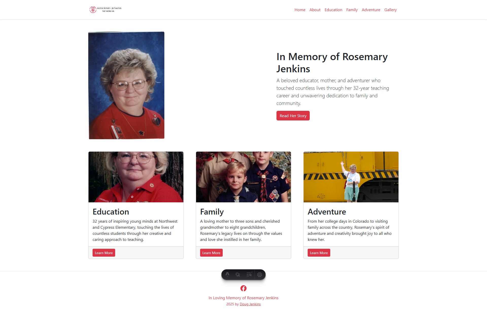

# Rose Mary Jenkins Memorial Website
[www.rosemarymemorial.org](https://www.rosemarymemorial.org)

## Goal
I created this solution as a memorial to my dear late mother, Rosemary Jenkins. She was such an important person in my life that I wanted to preserve her memory forever on the web.

I also took the opportunity to learn how to build a website using Astro and leveraging vibe to build the site using my product requirements listed below.

🚀[Product Requirements Document](docs/prd.md) \
🚀[Project To Do List](docs/todo.md)


## Screenshot


## Tech stack
- [Astro](https://astro.build/)
- [Bootstrap](https://getbootstrap.com/)
- [Puppeteer](https://pptr.dev/)


## Solution Setup
```sh
npm create astro@latest -- --template basics
```

## 🚀 Project Structure

Inside of your Astro project, you'll see the following folders and files:

```text
/
├── public/
│   └── favicon.svg
├── src/
│   ├── layouts/
│   │   └── Layout.astro
│   └── pages/
│       └── index.astro
└── package.json
```

To learn more about the folder structure of an Astro project, refer to [our guide on project structure](https://docs.astro.build/en/basics/project-structure/).

## 🧞 Commands

All commands are run from the root of the project, from a terminal:

| Command                   | Action                                           |
| :------------------------ | :----------------------------------------------- |
| `npm install`             | Installs dependencies                            |
| `npm run dev`             | Starts local dev server at `localhost:4321`      |
| `npm run build`           | Build your production site to `./dist/`          |
| `npm run preview`         | Preview your build locally, before deploying     |
| `npm run cf:dev`          | Build and run Cloudflare Worker locally          |
| `npm run cf:deploy`       | Build and deploy to Cloudflare Workers           |
| `npm run secrets:set`     | Upload secrets from `.env` to Cloudflare         |
| `npm run secrets:list`    | List all configured Cloudflare secrets           |
| `npm run astro ...`       | Run CLI commands like `astro add`, `astro check` |
| `npm run astro -- --help` | Get help using the Astro CLI                     |

## 🔐 Secrets Management

This project uses Cloudflare Workers secrets for secure configuration. See [docs/secrets-management.md](docs/secrets-management.md) for detailed instructions.

**Quick start:**
1. Copy `.env.example` to `.env` and fill in your values
2. Run `npm run secrets:set` to upload secrets to Cloudflare
3. Deploy with `npm run cf:deploy`
